# Player POI

## Features

## Limitations

## Requirements

- **X4: Foundations**: Version 8.00HF3 or newer.
- **UI Extensions and HUD**: Version v8.0.4.0 or higher by [kuertee](https://next.nexusmods.com/profile/kuertee?gameId=2659).
  - Available on Nexus Mods: [UI Extensions and HUD](https://www.nexusmods.com/x4foundations/mods/552)
- **Mod Support APIs**: Version 1.95 or higher by [SirNukes](https://next.nexusmods.com/profile/sirnukes?gameId=2659).
  - Available on Steam: [SirNukes Mod Support APIs](https://steamcommunity.com/sharedfiles/filedetails/?id=2042901274)
  - Available on Nexus Mods: [Mod Support APIs](https://www.nexusmods.com/x4foundations/mods/503)

## Caution

## Installation

- **Steam Workshop**: [Player POI](https://steamcommunity.com/sharedfiles/filedetails/?id=)
- **Nexus Mods**: [Player POI](https://www.nexusmods.com/x4foundations/mods/)

## Usage
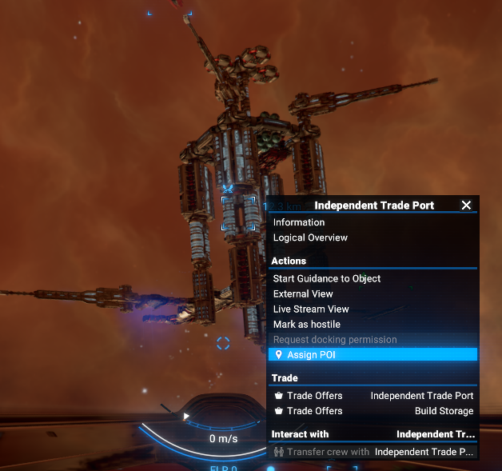
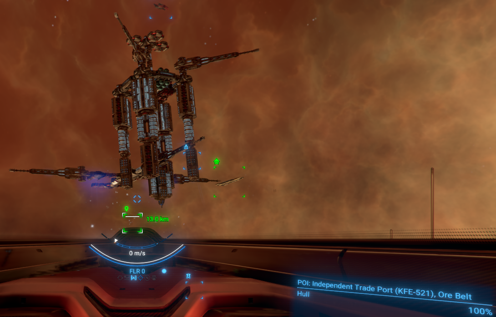
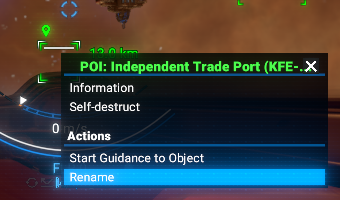
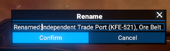
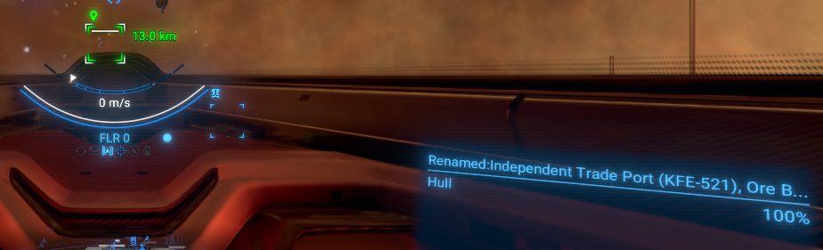
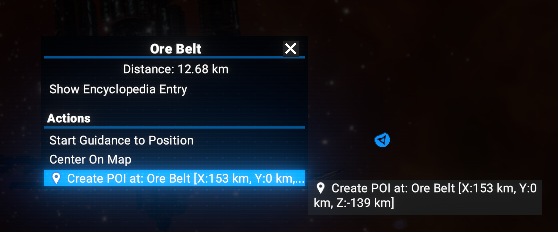
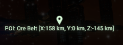
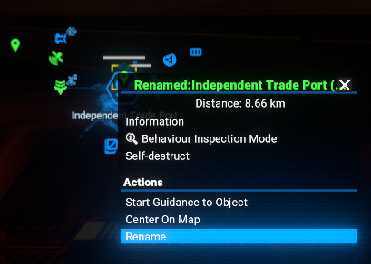
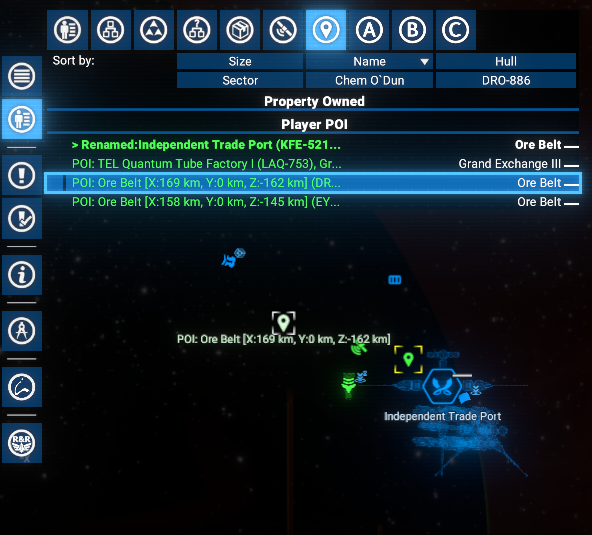
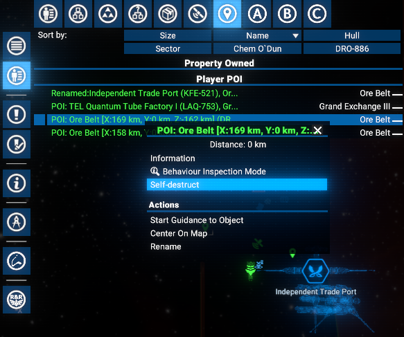
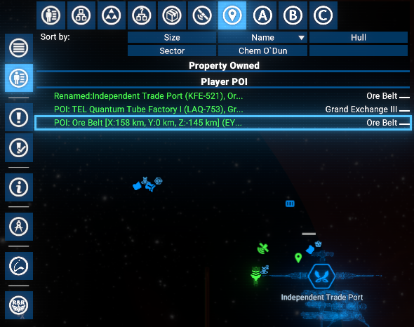
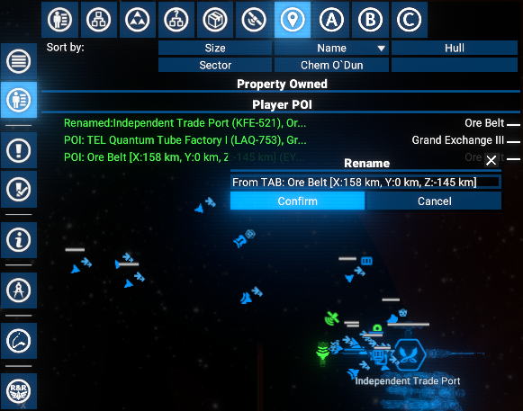
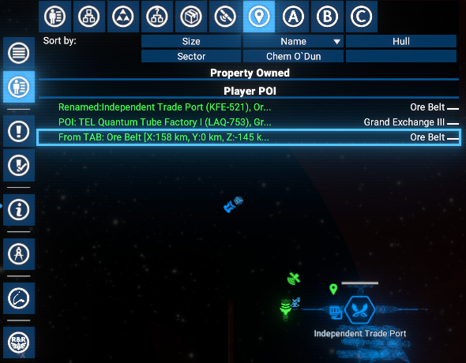
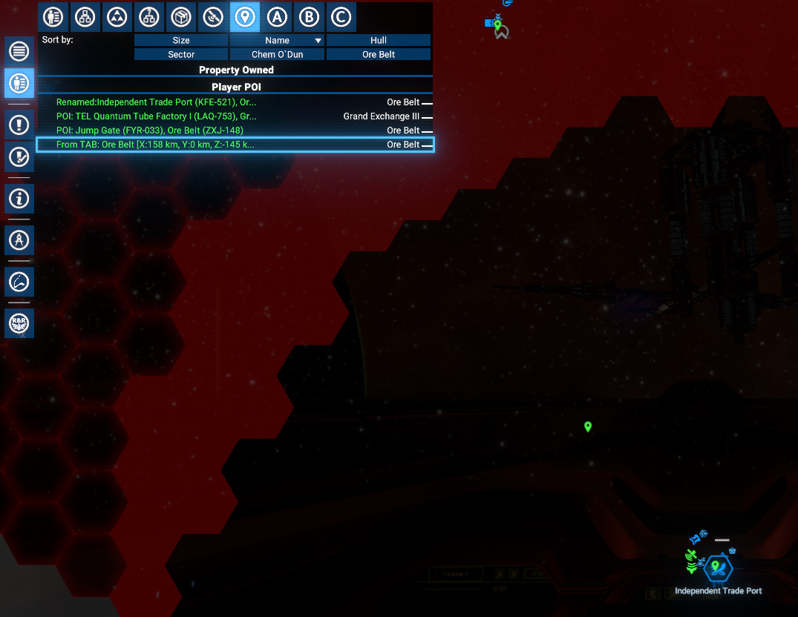
## Video

[Video demonstration of the . Version 1.00](https://www.youtube.com/watch?v=)

## Credits

- **Author**: Chem O`Dun, on [Nexus Mods](https://next.nexusmods.com/profile/ChemODun/mods?gameId=2659) and [Steam Workshop](https://steamcommunity.com/id/chemodun/myworkshopfiles/?appid=392160)
- *"X4: Foundations"* is a trademark of [Egosoft](https://www.egosoft.com).

## Acknowledgements

- [EGOSOFT](https://www.egosoft.com) — for the X series.
- [kuertee](https://next.nexusmods.com/profile/kuertee?gameId=2659) — for the `UI Extensions and HUD` that makes this extension possible.
- [SirNukes](https://next.nexusmods.com/profile/sirnukes?gameId=2659) — for the `Mod Support APIs` that power the UI hooks.

## Changelog

### [1.00] - 2026-02-??

- **Added**
  - Initial public version
