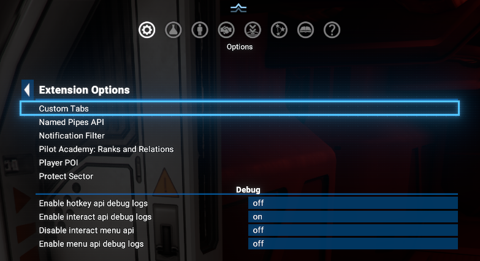
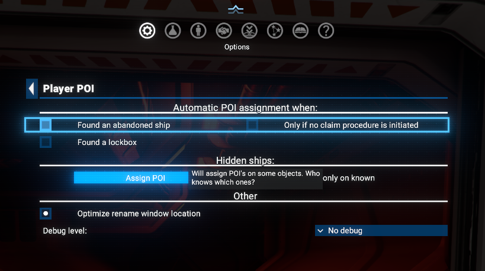
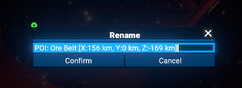
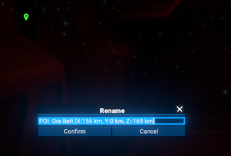

# Player POI

Marks abandoned ships, lockboxes, stations, and any point in space, either automatically or manually.

## Features

- **Creation of custom POIs** on the map at any location or by assignment to objects (non-player stations, gates, abandoned ships, lockboxes).
- **Automatic name generation** for POIs based on the assigned object name or location coordinates.
- **Automatic POI assignment** to newly discovered abandoned ships and lockboxes, with optional exclusion during claim procedures.
- **Duplicate prevention** - checks prevent creating multiple POIs at the same location.
- **POI management tab** in the Property Owned Information menu for centralized access to all your POIs.
- **Context menu** for POIs in space and on the map, with options to rename, self-destruct, or locate POIs.
- **Optimized rename window location** - rename dialog appears near the selected POI instead of at the mouse cursor.
- **A "hidden" feature** - discover it only by using the mod.

## Requirements

- **X4: Foundations**: Version 8.00HF3 or newer.
- **UI Extensions and HUD**: Version v8.0.4.0 or higher by [kuertee](https://next.nexusmods.com/profile/kuertee?gameId=2659).
  - Available on Nexus Mods: [UI Extensions and HUD](https://www.nexusmods.com/x4foundations/mods/552)
- **Mod Support APIs**: Version 1.95 or higher by [SirNukes](https://next.nexusmods.com/profile/sirnukes?gameId=2659).
  - Available on Steam: [SirNukes Mod Support APIs](https://steamcommunity.com/sharedfiles/filedetails/?id=2042901274)
  - Available on Nexus Mods: [Mod Support APIs](https://www.nexusmods.com/x4foundations/mods/503)

## Compatibility

- With [Custom Tabs](https://www.nexusmods.com/x4foundations/mods/842) mod by [Mycu](https://www.nexusmods.com/x4foundations/users/7018859)

### Limitations

- As the standard `Rename` window is used for renaming POIs, there is a standard game limitation on the name length that can be applied.
- `POI` is not attached to the assigned object, but there is a check implemented which will prevent a `POI` from being created if there already exists a `POI` close enough to the assigned object.

## Installation

- **Steam Workshop**: [Player POI](https://steamcommunity.com/sharedfiles/filedetails/?id=3672692813)
- **Nexus Mods**: [Player POI](https://www.nexusmods.com/x4foundations/mods/1990)

## Usage

### Creating a POI on the map

To create a `POI` on the map, simply open the holomap, right-click on any location and select `Create POI at ...` from the context menu. A new POI will be created at the selected location with a default name based on the coordinates.

The created `POI` will be visible on the map and in the `Player POI` tab of the Property Owned Information, where you can manage it (like renaming or self-destructing it) using the context menu.

Additionally, you can assign a `POI` to an object on the map (like a station, gate, abandoned ship, or lockbox) by right-clicking on the object and selecting `Assign POI` from the context menu. The `POI` will be created and automatically located near the object, and its name will be generated based on the object's name.

Context menu for assigning a `POI` to an object on the map is exactly the same as in space, see the next section for details.

### Creating a POI in space

In space, you can only assign a `POI` to an object (like a station, gate, abandoned ship, or lockbox) by right-clicking on the object and selecting `Assign POI` from the context menu. The `POI` will be created and automatically located near the object, and its name will be generated based on the object's name.

The created `POI` will be visible in space, on a map and in the `Player POI` tab of the Property Owned Information, where you can manage it (like renaming or self-destructing it) using the context menu.

### Managing POIs

You can manage your created `POIs` in space, on map and in the `Player POI` tab of the Property Owned Information.
All management actions (like renaming or self-destructing a `POI`) are available in the context menu, which can be accessed by right-clicking on a `POI` in space, on the map or in the tab.

#### Managing POIs in space

There is how the context menu for a `POI` in space looks like:

##### Renaming a POI in space

When you select "Rename" from the context menu of a `POI` in space, a rename window will open, allowing you to enter a new name for the `POI`.

As soon as you enter a new name and confirm it, the `POI` will be renamed.

#### Managing POIs on the map

Context menu for a `POI` on the map is the same as in space, but with an additional option to center the map on the `POI`:

#### Managing POIs in the Player POI tab

There is an additional tab in the Property Owned Information called `Player POI`, where you can see all your created `POIs` in one place. You can also manage your `POIs` from this tab using the same context menu as in space and on the map.

##### Self-destructing a POI

When you select "Self-destruct" from the context menu of a `POI`, the `POI` will be immediately removed from the game. This action cannot be undone, so use it with caution.
There is an example of a `POI` that is about to be self-destructed in the following screenshot:

And here is how the list of `POIs` looks like after the `POI` has been self-destructed:

##### Renaming a POI from the "Player POI" tab

When you select "Rename" from the context menu of a `POI` in the `Player POI` tab, a rename window will open, allowing you to enter a new name for the `POI`.

As soon as you enter a new name and confirm it, the `POI` will be renamed.

##### Player POI tab in the Property Owned Information

One more example of the `Player POI` tab in the Property Owned Information, showing several created `POIs` in space and on the map:

### Options

You can configure the mod in the options menu, which can be accessed from the `Player POI` item in `Extension Options`  menu.

Where the `Player POI` options menu looks like this:

#### Automatic POI assignment

There are two options group under the `Automatic POI assignment when:` section:

- `Found an abandoned ship` - when enabled, a `POI` will be automatically assigned to any found abandoned ship. But moreover, all already known abandoned ships will be assigned with `POI`s on enabling this option.

  This option has an additional sub-option `Only if no claim procedure is initiated`, which will only assign `POI`s to abandoned ships that are not currently being claimed by player. This means that if the player set a claim procedure on an abandoned ship as default action or selected this action by event menu, the `POI` will not be assigned to such ship.

- `Found a lockbox` - when enabled, a `POI` will be automatically assigned to any found lockbox. And similarly to previous, all already known lockboxes will be assigned with `POI`s on enabling this option.

#### Other

In this section, you can enable or disable `optimized` rename window location, which will make the rename window appear near the selected `POI` instead of the last mouse position.

There are two screenshots showing the difference between `optimized` and `standard` rename window location:

- `Optimized` rename window location (enabled):

  
- `Standard` rename window location (disabled):

  

In addition, for the resolving issues, you can enable debug logging in the options menu, which will log detailed information about the mod's operations to the X4 log file. This can be helpful for troubleshooting and understanding how the mod works.

## Video

- [Video demonstration of Player POI](https://www.youtube.com/watch?v=YpPnR0eNdJg)
- [Video demonstration of Automatic POI assignment](https://www.youtube.com/watch?v=RK7KkX5M588)

## Credits

- **Author**: Chem O`Dun, on [Nexus Mods](https://next.nexusmods.com/profile/ChemODun/mods?gameId=2659) and [Steam Workshop](https://steamcommunity.com/id/chemodun/myworkshopfiles/?appid=392160)
- *"X4: Foundations"* is a trademark of [Egosoft](https://www.egosoft.com).

## Acknowledgements

- [EGOSOFT](https://www.egosoft.com) — for the X series.
- [kuertee](https://next.nexusmods.com/profile/kuertee?gameId=2659) — for the `UI Extensions and HUD` that makes this extension possible.
- [SirNukes](https://next.nexusmods.com/profile/sirnukes?gameId=2659) — for the `Mod Support APIs` that power the UI hooks.

## Changelog

### [8.00.02] - 2026-02-25

- **Added**
  - Possibility to automatically assign POI's to found abandoned ships and lockboxes
  - And another interesting feature that will not be mentioned here

### [8.00.01] - 2026-02-24

- **Added**
  - Initial public version
